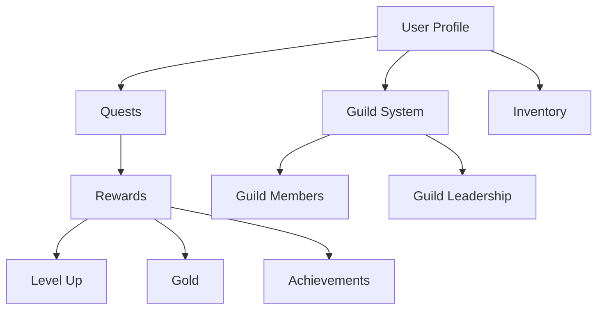

# QuestForge Task RPG

QuestForge transforms mundane daily tasks into exciting quests within a role-playing game framework on the Stacks blockchain. Users earn experience points, gold, and rewards while completing real-world tasks, leveling up their characters, and engaging in guild activities.

## Overview

QuestForge creates intrinsic motivation by connecting real-life productivity to digital achievements. The platform features:

- Task-to-Quest transformation
- Experience points and gold rewards
- Character leveling system
- Achievement tracking
- Guild system for social accountability
- Inventory management
- Blockchain-secured progression

## Architecture

The QuestForge system is built around a core smart contract that manages all game mechanics and user interactions.



### Core Components

1. **User Profiles**: Tracks character stats, level, experience, and gold
2. **Quest System**: Manages task creation, completion, and rewards
3. **Achievement System**: Recognizes user milestones and special accomplishments
4. **Guild System**: Enables social features and group accountability
5. **Inventory System**: Manages user items and rewards

## Contract Documentation

### QuestForge Core Contract (`questforge-core`)

#### Key Features

- User profile management
- Quest creation and completion
- Experience and gold rewards
- Achievement tracking
- Guild management
- Inventory system

#### Constant Values

```clarity
DIFFICULTY-EASY: u1
DIFFICULTY-MEDIUM: u2
DIFFICULTY-HARD: u3
DIFFICULTY-EPIC: u4

XP-REWARD-EASY: u50
XP-REWARD-MEDIUM: u100
XP-REWARD-HARD: u200
XP-REWARD-EPIC: u500
```

## Getting Started

### Prerequisites

- [Clarinet](https://github.com/hirosystems/clarinet)
- Stacks wallet
- Node.js environment

### Basic Usage

1. Create a user profile (automatic on first interaction)
2. Create a quest:
```clarity
(contract-call? .questforge-core create-quest 
    "Complete Project Report" 
    "Write and submit quarterly report" 
    u2 
    none)
```

3. Complete a quest:
```clarity
(contract-call? .questforge-core complete-quest u1)
```

4. Create or join a guild:
```clarity
(contract-call? .questforge-core create-guild 
    "Productivity Warriors" 
    "Guild focused on professional development")
```

## Function Reference

### Public Functions

#### Quest Management
```clarity
(create-quest (title (string-ascii 50)) (description (string-ascii 200)) (difficulty uint) (deadline (optional uint)))
(complete-quest (quest-id uint))
```

#### Guild Management
```clarity
(create-guild (name (string-ascii 50)) (description (string-ascii 200)))
(join-guild (guild-id uint))
(leave-guild (guild-id uint))
(transfer-leadership (guild-id uint) (new-leader principal))
```

### Read-Only Functions
```clarity
(get-user-profile (user principal))
(get-quest (quest-id uint) (owner principal))
(get-user-quests (user principal) (completed bool))
(get-guild (guild-id uint))
```

## Development

### Testing

1. Clone the repository
2. Install Clarinet
3. Run tests:
```bash
clarinet test
```

### Local Development

1. Start Clarinet console:
```bash
clarinet console
```

2. Deploy contract:
```bash
clarinet deploy
```

## Security Considerations

### Limitations

- Quests can only be completed by their creator
- Guild leaders must transfer leadership before leaving
- Item management is restricted to contract owner

### Best Practices

1. Always verify quest completion before rewarding
2. Ensure proper permission checks for guild operations
3. Validate all input parameters
4. Monitor for potential gaming of the reward system
5. Implement rate limiting for quest creation and completion